`llamadart` exposes two generation styles:

- `engine.generate(prompt)` for raw prompt strings.
- `engine.create(messages)` for chat-template aware completions.

## Generation pipeline (visual)

```mermaid
sequenceDiagram
    autonumber
    participant App as App/ChatSession
    participant Engine as LlamaEngine
    participant Template as Template engine
    participant Backend as Native/Web backend
    participant Parser as Stream parser

    App->>Engine: generate(prompt) or create(messages)
    alt create(messages)
        Engine->>Template: detect format + render template
        Template-->>Engine: prompt + stops + grammar
    end

    Engine->>Backend: start generation
    loop token stream
        Backend-->>Engine: token bytes
        Engine->>Parser: UTF-8 decode + partial parse
        Parser-->>App: streaming chunk delta
    end

    Backend-->>Engine: generation finished
    Engine->>Parser: finalize parse
    Parser-->>App: final chunk (finish reason/tool calls)
```



## Low-level generation API

```dart
await for (final token in engine.generate(
  'List two advantages of local LLM inference.',
  params: const GenerationParams(maxTokens: 64, temp: 0.4),
)) {
  print(token);
}
```

## Chat completion API

```dart
final messages = [
  LlamaChatMessage.fromText(
    role: LlamaChatRole.user,
    text: 'Explain top-p in plain language.',
  ),
];

await for (final chunk in engine.create(
  messages,
  params: const GenerationParams(maxTokens: 128, topP: 0.95),
)) {
  final text = chunk.choices.first.delta.content;
  if (text != null) {
    print(text);
  }
}
```

## `create(...)` flow at a glance

1. Build your `List<LlamaChatMessage>`.
2. `engine.create(...)` runs template rendering/parity logic.
3. Effective stop sequences and grammar are applied to generation params.
4. Backend token bytes are decoded and emitted as streaming chunks.
5. Final parse resolves tool calls and stop reason.

## Cancellation

```dart
engine.cancelGeneration();
```

Cancellation is immediate and backend-specific.

## Tokenization helpers

```dart
final tokens = await engine.tokenize('hello world');
final text = await engine.detokenize(tokens);
final count = await engine.getTokenCount('hello world');
```

These helpers are useful for context budgeting and prompt diagnostics.

## When to use which API

- Use `generate(...)` when you already have a final raw prompt and do not need
  chat-template tooling.
- Use `create(...)` for OpenAI-style message arrays, template routing, and
  tool-calling workflows.
