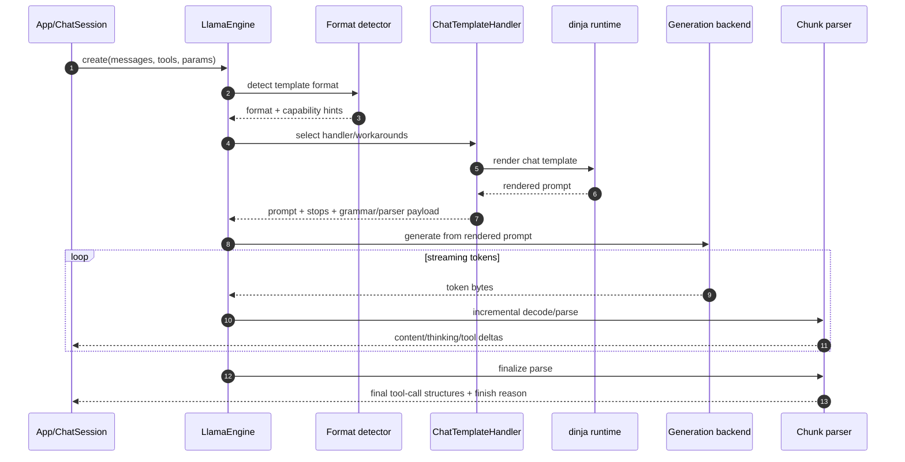

`llamadart` reimplements the `llama.cpp` chat-template/render/parse stack in
Dart so routing and parser behavior stay consistent across native and web
targets.

## Design goal

The template system prioritizes llama.cpp parity:

- format detection behavior
- handler routing logic
- tool-grammar attachment rules
- parse behavior for thinking and tool-call envelopes

## End-to-end pipeline

## Main components

### 1. Format detection

- `ChatTemplateEngine` detects format from template signatures.
- Each detected format maps to a concrete `ChatTemplateHandler`.
- Handlers live under `lib/src/core/template/handlers/`.

### 2. Template capabilities and routing

- `TemplateCaps` estimates whether a template supports system role, tools,
  parallel tool calls, typed content, and thinking channels.
- `JinjaAnalyzer` augments regex checks with AST analysis and probe rendering.
- Routing workarounds mirror llama.cpp behavior for schema mode, tool-choice
  behavior, and system-message adaptation.

### 3. Render stage

- Handler `render(...)` builds the final prompt and metadata payload.
- Result includes:
  - prompt text
  - stop sequences
  - optional grammar
  - optional PEG parser payload
  - preserved tokens and lazy grammar triggers

### 4. Parse stage

- During streaming, partial output is parsed incrementally for content/thinking
  deltas and tool-call envelopes.
- On completion, final parse produces stable tool-call structures and finish
  reason semantics.
- PEG-backed parse paths are used when parser payloads are present.

## `dinja` integration

`llamadart` uses [`dinja`](https://pub.dev/packages/dinja), the Dart Jinja
runtime used as the execution layer for model-provided chat templates
(`tokenizer.chat_template`).

`dinja` was built in the `llamadart` ecosystem as a Dart port of the
llama.cpp-style minimal Jinja execution model, then used as the foundation of
the template engine in this package.

Inside `llamadart`, the `jinja/` integration layer acts as the Dinja-plugin
surface: it wires llama.cpp-specific globals and capability analysis into
template execution.

Why this matters:

- no Python runtime dependency in app environments
- on-device template rendering in pure Dart
- reusable lexer/parser access for capability analysis (`JinjaAnalyzer`)

In practice, our template integration stack is:

1. `dinja` template execution for render.
2. `llamadart` routing/parity logic around it.
3. `llamadart` parser/grammar infrastructure for streamed output.

## Practical debugging flow

1. Call `engine.chatTemplate(...)` to inspect prompt/format/stops.
2. Verify tool schema and grammar expectations before generation.
3. Compare parsed output in partial vs final streaming stages.
4. Re-test after model/runtime upgrades to catch routing shifts early.

## Related docs

- [Chat Templates and Parsing](./chat-template-and-parsing)
- [Tool Calling](./tool-calling)
- [Generation and Streaming](./generation-and-streaming)
