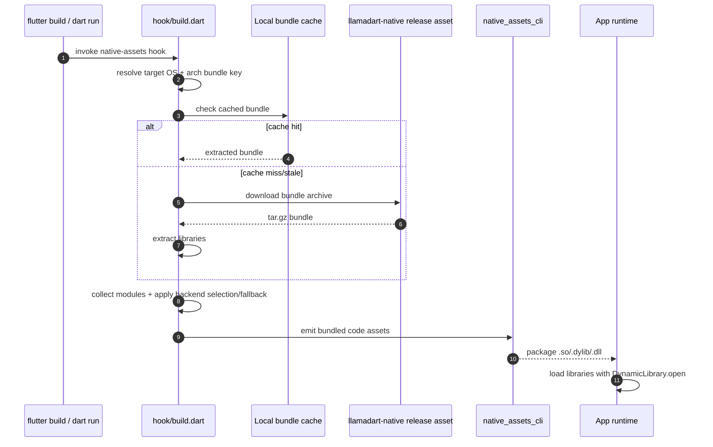

`llamadart` leverages Dart's `native_assets_cli` and a specialized build hook to seamlessly integrate `llama.cpp` into your Flutter and Dart applications without requiring you to compile C++ code locally.

## The Build Hook Process

When you run `flutter build` or `dart run`, the build system invokes this
package's native-assets hook at `hook/build.dart`. This script resolves and
downloads the correct precompiled binaries for your target platform.

### 1. Platform Detection
The hook inspects the target operating system (iOS, Android, macOS, Windows, Linux) and architecture (arm64, x64).

### 2. Binary Resolution
Instead of compiling `llama.cpp` from source—which requires CMake, Ninja, and various platform-specific toolchains—the hook downloads precompiled binaries directly from the **`leehack/llamadart-native`** bridge repository via GitHub Releases.

### 3. Dynamic Linking
Using `native_assets_cli`, the downloaded dynamic libraries (`.so`, `.dylib`,
`.dll`) are configured for **Dynamic Loading Bundled**. This ensures the
Flutter engine bundles the libraries into your final IPA/APK/desktop app, and
Dart FFI loads resolved library files at runtime with
`DynamicLibrary.open(...)`.

### 4. Validation and fallback safeguards
- Backend selection is bundle-aware: requested modules must exist in the
  platform/arch bundle.
- If requested modules are unavailable, the hook logs warnings and falls back
  to defaults.
- On `windows-x64`, the hook additionally validates CUDA/BLAS runtime
  dependencies before accepting a bundle.

## The `llamadart-native` Bridge Repo

Because `llama.cpp` is a fast-moving C++ project, `llamadart` isolates the native build complexities into a separate repository: [leehack/llamadart-native](https://github.com/leehack/llamadart-native).

**Why a separate repository?**
- **CI/CD Isolation**: Compiling GPU backends (Metal, CUDA, Vulkan) across 5 operating systems takes significant CI time. Isolating this prevents the main Dart package from becoming sluggish during development.
- **Versioning**: It allows the Dart package to tightly pin to a specific, stable commit of `llama.cpp`.
- **Precompiled Distributions**: It acts as the host for the GitHub Releases that the `build.dart` hook downloads, ensuring end-users never have to deal with CMake errors.
