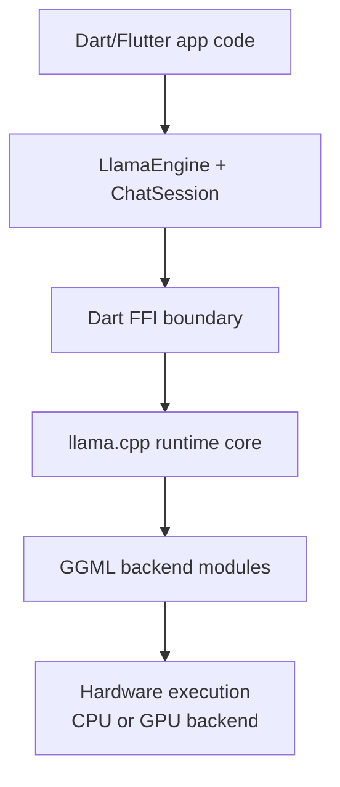

`llamadart` is a comprehensive Dart and Flutter framework that deeply integrates with the renowned **`llama.cpp`** library. This page explains our architectural approach and how the underlying inference engine operates.

## The Core: llama.cpp and GGML

At the heart of `llamadart` is `llama.cpp`—a C/C++ library designed for extremely fast, low-dependency inference of large language models. `llama.cpp` is built on top of **GGML**, a tensor math library specifically optimized for everyday hardware (CPUs) while extending support to GPUs.

## Architecture Overview

### Why llama.cpp?
- **Minimal Dependencies**: It does not rely on massive python ecosystems or heavy ML dependencies like PyTorch, making it perfectly suited for embedding in mobile apps (Android/iOS) and desktop clients.
- **Hardware Acceleration**: It actively exploits hardware-specific intrinsics (like ARM NEON on Apple Silicon/Android) and GPU backends (Metal on Macs, Vulkan on Windows/Linux).
- **GGUF Format**: It standardizes around the GGUF file format, which stores the neural network architecture, the quantized weights, and the tokenizer all in a single easily portable file.

## The Common Library

Within `llama.cpp` (and mirrored in `llamadart`), there is a concept of the "Common Library". This library acts as a crucial abstraction layer over the raw GGML tensor operations. 

It handles:
1. **Model Loading & Memory Mapping (mmap):** Instead of loading the entire heavy model into active RAM, the common library maps the GGUF file directly into virtual memory. This drastically reduces the initial memory spike and allows the OS to smartly page chunks of the model in and out as needed.
2. **Tokenization:** Mapping plain text to the integer IDs the neural network actually understands.
3. **Sampling Automation:** Executing the math behind `top-k`, `top-p`, and `temperature` logic based on the logits outputted by the model.

## Dart FFI and Native Bindings

To bridge the gap between Dart/Flutter and the `llama.cpp` C++ engine, `llamadart` relies heavily on **Dart FFI (Foreign Function Interface)**.

1. **Prebuilt Runtime Resolution**: During `flutter build` / `dart run`, this
   repo's native-assets hook resolves platform-specific prebuilt runtime
   bundles from `llamadart-native` and wires them into the application.
2. **Isolates**: To prevent heavy inference work from freezing app UIs, native
   backend operations run in background **Isolates**.
3. **Explicit Lifecycle Management**: Model/context resources are native and
   should be explicitly released with `await engine.unloadModel()` and
   `await engine.dispose()` (typically in `try/finally`), rather than relying
   on garbage collection timing.

This architecture guarantees that `llamadart` maintains the absolute maximum performance of raw C++ while presenting a safe, ergonomic, and asynchronous Dart API to mobile developers.
